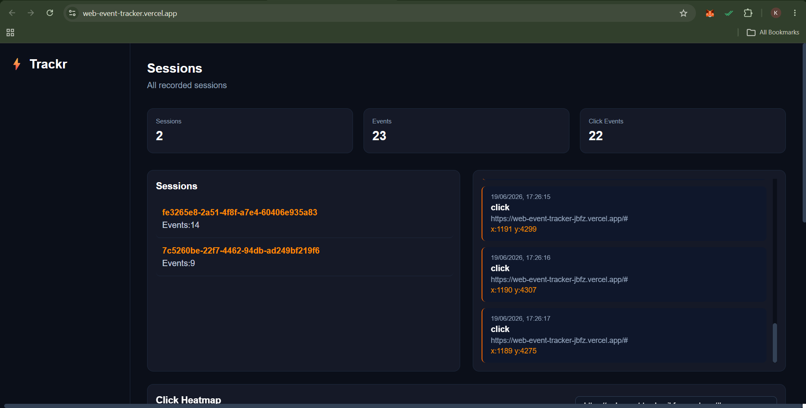
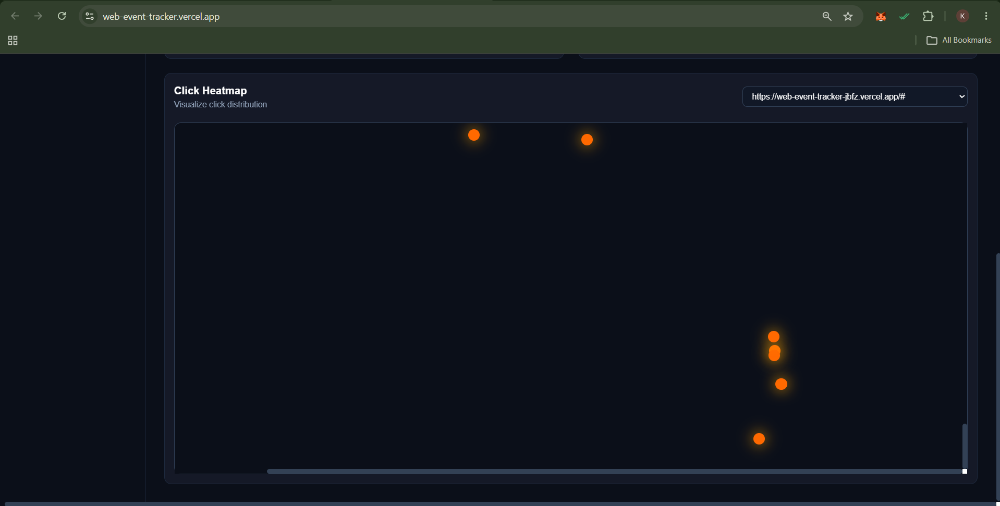

# ⚡ Web Event Tracker

A lightweight, full-stack web analytics platform that tracks user interactions (clicks, page views) on a landing page and visualizes them on a real-time dashboard — including session journeys and a click heatmap.



---

## 📁 Project Structure

```
web event tracking/
├── backend/              # Node.js + Express REST API
├── dashboard/            # React analytics dashboard (Vite)
└── product landing page/ # React demo product page with event tracking (Vite)
```

---

## 🛠️ Tech Stack

| Layer              | Technology                                     |
|--------------------|------------------------------------------------|
| **Backend API**    | Node.js, Express.js                            |
| **Database**       | MongoDB Atlas (via Mongoose ODM)               |
| **Tracker Script** | Vanilla JavaScript (IIFE, Fetch API)           |
| **Dashboard**      | React 18, Vite, Tailwind CSS, Axios, Recharts  |
| **Landing Page**   | React 18, Vite, Tailwind CSS, MUI, Radix UI    |
| **Hosting**        | Render (backend) + Vercel (frontends)          |

---

## ✅ Features

- 🖱️ **Click tracking** — records x/y coordinates of every click
- 📄 **Page view tracking** — fires on every page load
- 🔑 **Session management** — assigns a persistent UUID per browser session via `localStorage`
- 📊 **Real-time dashboard** — view sessions, total events, and click counts
- 🗺️ **Click heatmap** — visualize click distribution overlaid on a coordinate canvas
- 🛤️ **User journey** — replay all events from a specific session in chronological order

---

## ⚙️ Setup Steps

---

### 1. Clone the Repository

```bash
git clone https://github.com/YOUR_USERNAME/YOUR_REPO.git
cd "web event tracking"
```

---

### 2. Backend Setup

```bash
cd backend
npm install
```

Create a `.env` file in the `backend/` directory:

```env
PORT=5000
MONGODB_URI=your_mongodb_connection_string_here
```

Start the server:

```bash
node server.js
# Server is running on port 5000
```

The API will be available at `http://localhost:5000/api/events`.

---

### 3. Dashboard Setup

```bash
cd dashboard
npm install
```

Create a `.env` file in the `dashboard/` directory:

```env
VITE_API_URL=http://localhost:5000/api/events
```

Start the dev server:

```bash
npm run dev
# Dashboard running at http://localhost:5174
```

---

### 4. Product Landing Page Setup

```bash
cd "product landing page"
npm install
```

Create a `.env` file in the `product landing page/` directory:

```env
VITE_API_URL=http://localhost:5000/api/events
```

Start the dev server:

```bash
npm run dev
# Landing page running at http://localhost:5173
```

Now visit the landing page, click around, and watch the events appear in your dashboard!

---

## 🚀 Production Deployment

In summary:
1. Deploy `backend/` to Render — add your `MONGODB_URI` as an environment variable.
2. Deploy `dashboard/` to Vercel — set `VITE_API_URL` to your live Render API URL.
3. Deploy `product landing page/` to Vercel — set the same `VITE_API_URL`.

---

## 🔌 API Reference

All routes are under `/api/events`.

| Method | Route              | Description                              |
|--------|--------------------|------------------------------------------|
| `POST` | `/`                | Record a new event (click / page_view)   |
| `GET`  | `/sessions`        | List all sessions with total event count |
| `GET`  | `/sessions/:id`    | Get all events for a specific session    |
| `GET`  | `/heatmap?url=...` | Get click events filtered by page URL    |
| `GET`  | `/pages`           | Get all distinct tracked page URLs       |
| `GET`  | `/all`             | Get every recorded event                 |

### Event Payload (POST `/`)

```json
{
  "session_id": "uuid-string",
  "event_type": "click | page_view",
  "page_url": "https://example.com/",
  "timestamp": "2026-06-19T08:00:00.000Z",
  "x": 250,
  "y": 660,
  "page_width": 1440,
  "page_height": 3200
}
```

---

## ⚖️ Assumptions & Trade-offs

### Assumptions

- **Single-page tracking**: The tracker is designed for a single-page React application. It fires `page_view` once on load and tracks all click events globally.
- **Client-side session identity**: Sessions are identified by a UUID stored in `localStorage`. If a user clears browser storage, they will be assigned a new session on their next visit.
- **Trusted environment**: No authentication or API key is required to post events. This is appropriate for an internal demo but should be hardened before use in a public production environment.
- **MongoDB Atlas**: A cloud-hosted MongoDB instance is assumed. No local database setup is required.

### Trade-offs

| Decision | Trade-off |
|---|---|
| **IIFE tracker script** bundled via Vite | Simple integration via `import` in `main.tsx`, but tightly couples the tracker to the React build pipeline. A standalone `<script>` tag would be more portable. |
| **`localStorage` for session ID** | Works without a server, but is not shared across tabs in incognito mode and can be cleared by the user. Cookies would be more robust. |
| **x/y coordinates are absolute page position (`e.pageX/Y`)** | Coordinates account for scrolling correctly, but the heatmap canvas uses a fixed 1200×1200px space by default. Dots may cluster if the actual page is much larger. |
| **No authentication on the API** | Simplifies the demo setup, but any person who knows your API URL could send arbitrary events. |
| **Polling via page refresh (no WebSockets)** | The dashboard does not auto-refresh. You must reload the page manually to see new events. Adding WebSocket support would enable a true real-time experience. |
| **`cors()` accepts all origins** | Convenient for development, but in production the backend should whitelist only the deployed frontend URL. |
